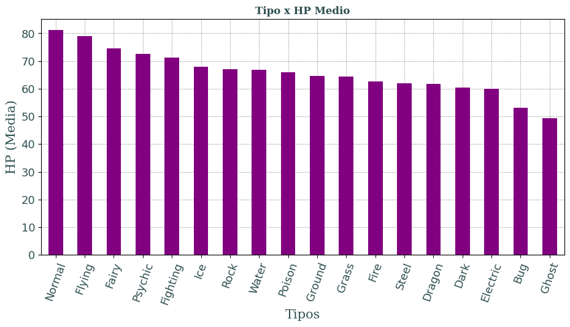

# Pykemon: Análisis de Datos Pokémon con Python 🐉🐍

Este proyecto ha sido desarrollado para la asignatura **Fundamentos de Sistemas de Información** del Grado en Ingeniería Informática. El objetivo principal es demostrar la competencia en el uso de Python para el procesamiento, almacenamiento y visualización de datos utilizando un dataset real de Pokémon.

## 📊 Sobre el Dataset
El proyecto utiliza el archivo `15_pokemon.csv`, que incluye estadísticas detalladas de las primeras 6 generaciones:
* **Identificadores**: ID, Nombre y Tipos (1 y 2).
* **Estadísticas de combate**: HP, Ataque, Defensa, Sp. Atk, Sp. Def y Velocidad.
* **Atributos**: Generación y estado de Legendario.

## 📁 Estructura del Proyecto (P1 - P6)
Siguiendo los requisitos académicos, el código se organiza en seis paquetes dentro de la carpeta `/Experimentos`. Cada uno resuelve una etapa distinta del tratamiento de datos:

| Paquete | Descripción | Archivos Clave |
| :--- | :--- | :--- |
| **P1** | Fundamentos de lógica, condicionales y estructuras básicas. | `P1.py` |
| **P2** | Programación Orientada a Objetos (POO) y modelado de datos. | `P2.py`, `P2_UML.png` |
| **P3** | Persistencia de datos mediante **SQLite** y gestión de bases de datos. | `P3.py`, `pokemon.db` |
| **P4** | Manipulación avanzada de datos y lógica de negocio. | `P4.py` |
| **P5** | Análisis exploratorio con **Pandas** (Filtrado, limpieza y agrupación). | `p5.ipynb` |
| **P6** | Visualización de datos con **Seaborn** y **Matplotlib**. | `P6.ipynb`, `*.png` |

---

## 📈 Análisis y Visualizaciones
El módulo **P6** automatiza la generación de conocimiento visual a partir del dataset bruto. Algunos de los análisis incluidos son:

* **Distribución de HP por tipo**: Comparativa de la salud base según el tipo elemental.
* **Correlación de tipos**: Análisis de las combinaciones de tipos más comunes y sus estadísticas medias.
* **Frecuencia de Tipos**: Gráfico de barras que muestra la predominancia de ciertos tipos en las 6 generaciones.

## 📝 Documentación Adicional
* **Enunciado**: El archivo `Trabajo de Python.pdf` detalla los criterios de evaluación y los objetivos pedagógicos.
* **Modelado**: En la carpeta `P2` se incluye un diagrama UML que describe la arquitectura de clases utilizada.
* **Entorno**: El proyecto incluye la configuración de **PyCharm** (carpeta `.idea`) para facilitar su revisión técnica.
* **Ejemplos**: Se incluye una carpeta `Ejemplo` con datasets alternativos utilizados durante la fase de pruebas.

## 👤 Autor
* **Luis Carmona** - [@eLeCe2611](https://github.com/eLeCe2611)

---
*Este proyecto tiene fines puramente académicos para el Grado de Ingeniería Informática.*
